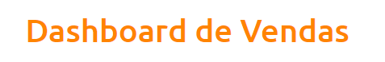
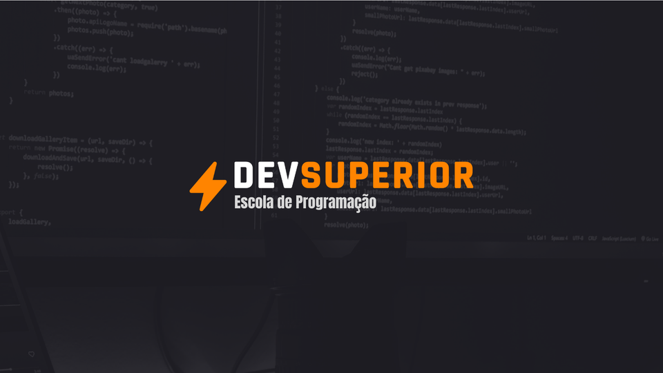

<h1 align="center">
    
</h1>

<p align="center">
  <a href="#-projeto">Projeto</a>&nbsp;&nbsp;&nbsp;|&nbsp;&nbsp;&nbsp;
  <a href="#-tecnologias">Tecnologias</a>&nbsp;&nbsp;&nbsp;|&nbsp;&nbsp;&nbsp;
  <a href="#-executar aplicação">Executar Aplicação</a>&nbsp;&nbsp;&nbsp;|&nbsp;&nbsp;&nbsp;
  <a href="#-licença">Licença</a>
</p>

<p align="center">
 

  
</p>

<br>

## 💻 Projeto

### [Acessar o projeto](https://dashboard-vendas-wanderson-timoteo.netlify.app/)

<br>

O projeto DSVendas consiste em uma análise de dados para demonstração de forma visual por meio de gráficos as vendas realizadas. Usando Banco de Dados Relacional e entrega continua. <br>
<br>
O banckend (API) foi desenvolvido com Spring Boot, utilizando o Banco de Dados PostgreSQL e efetuado deploy no Heroku. <br>  
O frontend foi desenvolvido com React.js, utilizando Axios para integração com o Backend e deploy no Netlify. 💜

---

<br>

## Prévia vizualização do Front-end

Tela inicial do sistema.

<p align="center">
</p>    

<br>

---

<br>
Dashboard de Vendas

<p align="center">
    
</p>
<br>

---

<br>
Dashboard de Vendas

<p align="center">
    
</p>
<br>

---

<br>

## 🚀 Tecnologias

Esse projeto foi desenvolvido com as seguintes tecnologias:

- [Node.js](https://nodejs.org/en/)
- [React.js](https://reactjs.org/)
- [PostgreSQL](https://sqlite.org/index.html)
- [Bootstrap](https://getbootstrap.com/)
- [Axios](https://axios-http.com/)
- [TypeScripts](https://www.typescriptlang.org/)
- [Java](https://www.oracle.com/java/technologies/downloads/)
- [Spring Boot](https://start.spring.io/)
- [Heroku](https://www.heroku.com/)
- [Netlify](https://www.netlify.com/)
- [Apexcharts](https://apexcharts.com/)

<br>

---

<br>

## Executar Aplicação

## 🔥 Executando Localmente a Aplicação

Caso você deseja executar o projeto na sua máquina local, você terá que instalar o Node.js, Java JDK e outras ferramentas. <br>

- [Configurações Necessárias](https://www.youtube.com/playlist?list=PLNuUvBZGBA8kMTSPMmmNiRm2z0gRxXxox)
  <br>
  Após instalar, basta seguir os passos abaixo:

### 🌀 Começando...

Para começar, você deve simplesmente clonar o repositório do projeto na sua máquina e instalar as dependências.

#### ❗️ Instalando as Dependências (via Windows):

Abre o cmd (caso esteja utilizando o Windows) navegue até o local onde você clonou o projeto

```
cd "C:\Users\NomeDoComputador\Documents\clonedoprojeto"
```

Depois, quando estiver na pasta do projeto
dashboard-vendas, dentro dela terá as pastas frontend e backend,. <br>
Você precisará executar 2 passos: <br>

1 - PASSO <br>
Acessar o projeto frontend na pasta `frontend` digitar no cmd a seguinte instrução: **(dentro da pasta `frontend` do projeto clonado)**

```
yarn install
```

Ao digitar a instrução acima, automaticamente ele irá baixar todas as dependências listadas e definidas no arquivo package.json:

- `node_modules` - que contêm os packages do npm que precisará para o projeto.

#### 💨 Executando a Aplicação

Bom, agora **(dentro da pasta `frontend` do projeto clonado)** abra um terminal para o projeto ser executado e digite:

```
yarn start
```

Pronto! dessa forma o projeto frontend estará rodando localmente em sua maquina, acesse:

```
http://localhost:3000
```

<br>

---

<br>

2 - PASSO <br>
Usando a ferramenta Spring Tool Suite 4, importe a pasta `backend` e faça a instalação das dependencias: **(dentro da pasta `backend` do projeto clonado)**

#### 💨 Executando a Aplicação

Bom, agora **(execute o projeto `backend`)** com Spring Tool Suite 4.

Pronto! dessa forma o projeto backend estará rodando localmente em sua maquina, acesse:

```
http://localhost:8080
```

<br>

---

<br>

## 🚩 Tenho Dúvidas... O que fazer?

Caso tenham dúvidas sobre o código do projeto, sintam-se a vontade em abrir uma **[ISSUE AQUI](https://github.com/Wanderson-A-Timoteo/dashboard-vendas/issues)**. Assim que possível, estarei respondendo a todas as dúvidas que tiverem!

<br>

---

<br>

## Licença

Esse projeto está sob a licença MIT. Veja o arquivo [LICENSE](LICENSE.md) para mais detalhes.

<br>

---

<br>

## Autor:

Feito com ♥ by

- [**Wanderson A. Timóteo**](https://wanderson.tk)

<br>

---

<br>

## Agradecimentos:

<br>

<h1 align="center">
    
</h1>

- Projeto desenvolvido durante a [Semana Spring React](https://devsuperior.com.br/) da escola DevSuperior.

- Agradecimento ao [Nelio Alves](https://github.com/acenelio) por compartilhar conteúdo relevante e com qualidade de ensino.
